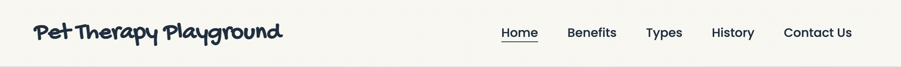

# Pet Theraphy Playground project

The Pet Therapy Playground project is a small static website for a fictional charity, supporting anybody in distress or struggling with their mental health with free pet therapy in central London.

This project is for educational purposes only. My goal is to build responsive website with HTML and CSS only.

&nbsp;  

## Table of Contents
---

- [UX](#ux)
    - [Website owners goals](#website-owners-goals)
    - [Users goals](#users-goals)
    - [Wireframes](#wireframes)
    - [Website design elements](#website-design-elements)
        - [Colors](#colors)
        - [Fonts](#fonts)
        - [Images](#images)
- [Features](#features)
    - [Navigation](#navigation)
    - [Home page](#home-page)
    - [Footer](#footer)
    - [Benefits page](#benefits-page)
    - [Types page](#types-page)
    - [History page](#history-page)
    - [Contact page](#contact-page)
- [Tecnologies used](#tecnologies-used)
- [Testing and Validation](#testing-and-validation)
    - [HTML and CSS](#html-and-css)
    - [Accessibility and Responsiveness](#accessibility-and-responsiveness)
    - [Compatibility](#compatibility)
    - [Bugs](#bugs)
    - [Unfixed Bugs](#unfixed-bugs)
- [Deployment](#deployment)
- [Credits](#credits)

&nbsp;

## UX
---

### Website owners goals
The goal is to attract new possible users of the charity facility and inform them as much people as possible about the benefits of Pet Therapy.
This website is targeted to everybody that would like to have informations about this kind of therapy and would love to participate.

The audience is very wide and goes from small children to older adults. This is why is important that the website is clear, simple and accessible to navigate for everybody, from parents wanting to bring their children to the facility, to employers organizing company activities or universities looking to support their students. 

### Users goals
Users of this website will be able to find useful information about the benefits of pet therapy, the different types available and the history of the practice. Equally important, they will be able to find informations about the Playground location, time of operations and how to get in contact with the staff, to book a session for themselves.

### Wireframes
Initial wireframes of the design, created with Balsamiq.

### Website design elements
#### Colors
The colours chosen for the project are:
* backfround color: #ffffff
* sections highlight background color: #f8f7f1
* sections - call to action background color: #eec049
* font color: #0e3040
* link and buttons background color: #0e3040
* link and buttons text color: #ffffff

The palette of color for the website is designed to have eccelent color contast and has been tested with the use of webaim.org Contast Checker. https://webaim.org/resources/contrastchecker/

#### Fonts
The main font is the Poppins Google Font, and as a backup font sans-serif.
The Pet Therapy Playground logo was produced using the Gochi Hand Google Font, and as a backup font cursive.

#### Images
Images are from [Unsplash](https://unsplash.com/) and [Pexels](https://www.pexels.com/)

[Back to Table of contents](#table-of-contents)

&nbsp;  

## Features
---

### Navigation

The navigation menu at the top is designed to be simple to use and easy to find. The visual indicator of the current active page allows the user to orientate easily on the website.
The menu is responsive and the links adjust to a smaller viewport in a column layout.

&nbsp;

### Home Page
The home page introduces immediately the user on what the website is about and has in the different sections a preview of what the user can find in the other pages if they want to go into more details about this subject.

&nbsp;

### Footer
The footer is designed to be minimalistic and provide clear links to the social media accounts. It is not too crowded and does not clutter the webpage.

&nbsp;

### Benefits page
The benefits page is designed to introduce more detailed information about Pet Therapy, without beign plain and boring text, but integrating instead different videos on the subject to keep the user informed but also entertained.

&nbsp;

### Types page
This page has also a lot of information available to the user. To keep the page interesting and visually appealing, the various sections are designed with appropriate and appealing background images.

&nbsp;

### History page
The History page containes together with the important informations, pictures of the people involved which helps the user to connect with the history of this practice and understand the value of the research that went into studing the benefits of Pet Therapy.

&nbsp;

### Contact page
The Contuct page has a simple and clutter free design. The user is not overwealmed with information and can clearly find useful information like location and time of operation of the charity. The first section of the page is the contact form that allows the user to communicate with the staff or book a session, which makes it very easy to find and accessible.

&nbsp;

### Future implementations

* Create a Blog with updates about events and activities
* Create live chat service for people in need of immediate response from the staff
* Create forum as a space for user to communicate directly in-between each other through the website

[Back to Table of contents](#table-of-contents)

&nbsp;  

## Tecnologies used
- HTML as structure language
- CSS as style language
- Font Awesome as and icon library for social links
- Google Fonts as font resource
- GitHub as software hosting platform to keep project in a remote location
- Git as version-control system tracking
- GitPod as developer hosting platform
- Balsamiq as wireframing tool application
- GIMP (GNU Image Manipulation Program) as image editor

[Back to Table of contents](#table-of-contents)

&nbsp;  

## Testing and Validation
---

### HTML and CSS
The code of every page and the stylesheet has been tested with:
- W3C Markup Validation Service 
- W3C CSS Validation Service. 

The errors found have been corrected.

&nbsp;

### Accessibility and Responsiveness
The website has been tested with Chrome Deveoper Tools and Google Lighthouse to validate performance and accessibility ratings. The bugs and error were corrected.

&nbsp;
Desktop results:

&nbsp;
Mobile results:

&nbsp;

### Compatibility
The website was tested using Chrome developer tools and Mozilla Developer tools.
The website was tested with Chrome, Mozilla, Safari and Edge browsers on both a Mac computer and a Windows computer; it was also tested for mobile on an iPhone 6, iPhone 11, iPhone 13 Pro, Pixel 4, Pixel 5 and Galaxy S10.

### Bugs
Incorrect use of the aria-label tag was found with Lighthouse, since the tag was applied to the div container instead of the iframe tag. This was corrected.

A bug was found when using Edge browser: two images were not loading correctly. Replaced the images using .webp format instead.

### Unfixed Bugs
No unfixed bugs.

## Deployment
---

The website was deployed using GitHub Pages. Changes were committed to git version control system.

Steps to deploy:
- In the [GitHub repository](https://github.com/alessandracosta8/pettherapyplayground), navigate to the Settings tab
- From the side menu select Pages
- The link to the live website can be found there

The live link can be found here also - https://alessandracosta8.github.io/pettherapyplayground/

&nbsp;

To run locally:
- In the [GitHub repository](https://github.com/alessandracosta8/pettherapyplayground)
- Select `Code` and select the dropdown menu, click Download the ZIP file
- after the download, extract the files and use it in your local environment

You are free to use this code, [Clone](https://docs.github.com/en/repositories/creating-and-managing-repositories/cloning-a-repository) or [Fork](https://docs.github.com/en/get-started/quickstart/fork-a-repo) this [GitHub repository](https://github.com/alessandracosta8/pettherapyplayground) into your own github account.

&nbsp;

## Credits
---

Code for the social media links in the footer was taken from CI Love Running project. 

The use of CSS Flexbox was taken from [CSS Tricks](https://css-tricks.com/snippets/css/a-guide-to-flexbox/).

Ho to embed a video into the page and keep it responsive was taken from [CSS Tricks](https://css-tricks.com/fluid-width-video/).

Visually hiding content that will be read by a screen reader was taken from [Webaim.org](https://webaim.org/techniques/css/invisiblecontent/#offscreen).

Images are from [Unsplash](https://unsplash.com/) and [Pexels](https://www.pexels.com/).

Map embedded from [Google Maps](https://www.google.com/maps).
